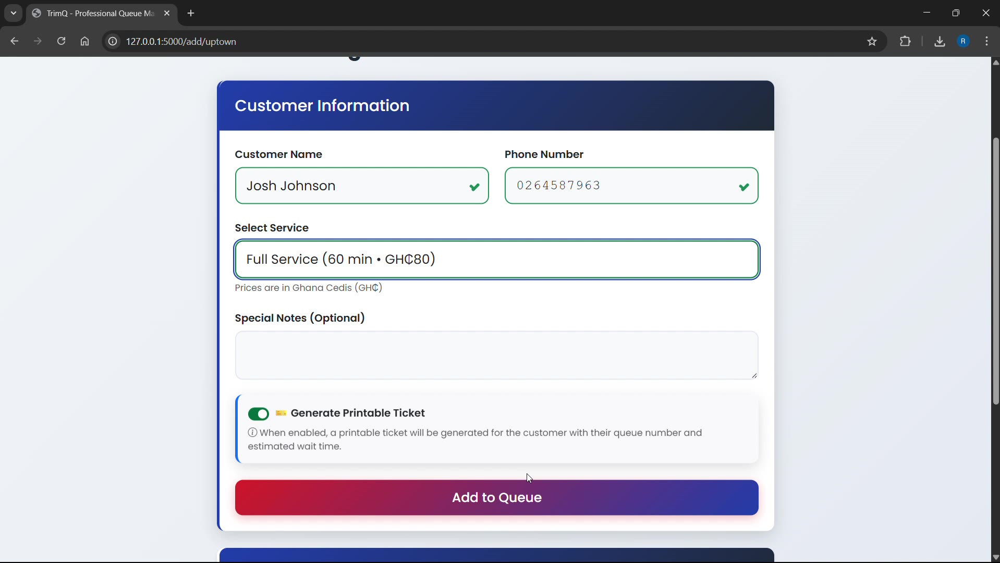
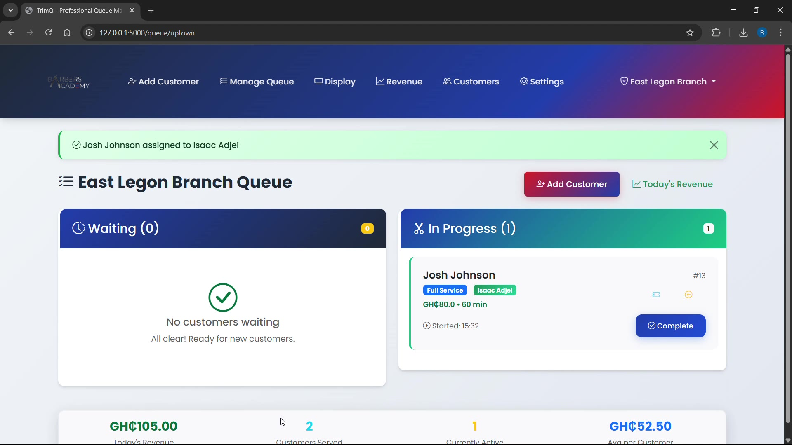
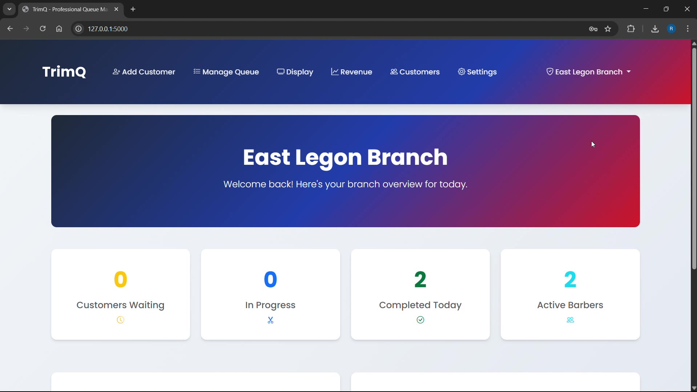

# TrimQ

Queue management for barber shops that run on walk-ins rather than appointments.

Most salon software assumes a calendar: customers book a slot, the shop works the
bookings. That is not how a neighbourhood barber shop in Ghana operates. People
arrive when they arrive, wait in the room, and get seen in order. So TrimQ is
built around a live queue instead of a diary: staff add a walk-in at the counter,
the customer gets a ticket with their position, and a screen in the waiting area
shows who is being served and who is next.

It handles several branches under one owner, so a franchise can see each shop
separately and all of them together.

## Screenshots

### Customer intake

Staff add a walk-in, pick a service from the branch's catalogue, and optionally
generate a printable ticket carrying the queue number and estimated wait.



### Queue board

Who is waiting, who is being served and by which barber, and the day's revenue
totalled live underneath. Assigning a customer to a barber moves them across and
starts the clock.



### Branch dashboard



## What it does

**Queue.** Add a walk-in with name, phone, service and notes. Assign them to a
barber, which moves them to in-progress and starts timing. Complete the service,
which records the visit and adds the service price to the day's revenue.

**Tickets.** A printable ticket carrying the queue number, the service and an
estimated wait. Optional; the shop can run entirely off the board.

**Waiting-room display.** A separate full-screen view at `/display/<branch_code>`
intended for a TV in the waiting area, showing who is being served and who is up
next. It refreshes itself, so nobody has to touch it.

**Branches.** Each branch has its own admin, barbers, and view. A master admin
sees every branch and can compare them.

**Revenue.** Totals accumulate as services are completed, in Ghana Cedis, per
branch and across the franchise, with a report view and a JSON endpoint behind it.

**Customers.** Profiles with optional photo, phone lookup, notes, and the history
of what each person has had done and when.

**Accounts.** Username and password login with hashed passwords, and a
password-reset flow over email using single-use tokens.

## Running it

Python 3.8 or newer.

```bash
pip install -r requirements.txt
python app.py
```

Open <http://127.0.0.1:5000>. On first run the database file is created and
seeded with three demo branches, a service catalogue and the accounts below, so
there is something to click on immediately.

### Demo accounts

Seeded for the demo. **Change them before running this anywhere real.**

| Role | Username | Password | Sees |
|---|---|---|---|
| Master admin | `master_admin` | `master123` | All branches |
| Branch admin | `main_admin` | `main123` | Main Branch, Osu |
| Branch admin | `downtown_admin` | `downtown123` | Downtown Branch, Adabraka |
| Branch admin | `uptown_admin` | `uptown123` | East Legon Branch |

### Configuration

Copy `.env.example` to `.env` and fill in what you need. Nothing is required to
run locally.

| Variable | Effect |
|---|---|
| `SECRET_KEY` | Signs session cookies. Unset, a random key is generated at startup, so sessions drop on every restart. Set it for any real deployment. |
| `MAIL_SERVER`, `MAIL_PORT`, `MAIL_USERNAME`, `MAIL_PASSWORD` | Password-reset email. For Gmail, `MAIL_PASSWORD` must be an App Password. Without these the reset flow is disabled. |
| `DATABASE_URL` | Defaults to `sqlite:///trimq_franchise.db`. See the note under Limitations before pointing it elsewhere. |

## How it is built

Flask, 42 routes and 7 models in a single `app.py`, with Jinja templates and
Bootstrap 5. SQLite through Flask-SQLAlchemy. Flask-Login for sessions,
Flask-WTF and WTForms for form handling and validation, Werkzeug for password
hashing, Pillow for customer photos. The front end is server-rendered with
vanilla JavaScript and a few AJAX calls for the live numbers.

### Data model

`User` (accounts and role), `Branch`, `Service` (name, duration, price),
`Barber` (assigned to a branch), `Customer` (the queue entry itself, carrying
status and timestamps), `CustomerVisit` (the completed-service record that
revenue and history are built from), and `PasswordReset` (single-use tokens).

Two roles: `master_admin` sees and manages everything, `branch_admin` is scoped
to one branch.

### Wait-time estimate

Worth being precise about, because it is the number customers care about most.
`get_wait_time` sums the configured durations of every service ahead of you in
the same branch's waiting list. That is all it does. See Limitations.

### JSON endpoints

| Endpoint | Returns |
|---|---|
| `/api/revenue/<branch_code>` | Live revenue for one branch |
| `/api/revenue/all` | Franchise-wide revenue, master admin only |
| `/api/customers` | Customer management data |
| `/api/remove_customer/<id>` | Removes a customer from the queue |

### Keyboard shortcuts

`Alt+T` ticket for the first waiting customer, `Alt+C` complete the first
in-progress service, `Alt+R` refresh revenue, `Alt+N` add a customer, `Ctrl+R`
manual refresh on revenue reports.

## Limitations

Stated plainly, because they are the things you would find in an hour anyway.

- **The wait estimate is optimistic when the shop is busy.** It adds up the
  service durations of everyone ahead of you and stops there. It does not account
  for how many barbers are free, or for how far through a cut the in-progress
  customers already are. With four barbers working, the real wait is a fraction
  of the number shown.
- **The waiting-room display reloads the whole page every 30 seconds.** No
  websocket, no polling of a diff. It is the simplest thing that works on a TV
  nobody will touch, and it is not efficient.
- **SQLite only.** It is the only backend this has run against and the only
  driver in `requirements.txt`. `DATABASE_URL` will accept a Postgres string, but
  nothing will work until a driver is added and the schema is migrated. There are
  no migrations; the schema is created from the models.
- **`app.py` is one 2,300-line file.** There is no test suite, so nothing put
  structural pressure on it while features were added in the order the shop asked
  for them. The direction it should go is blueprints per area and the queue and
  revenue logic pulled into a service layer.
- **No tests.**
- **The wait-time query is N+1.** It fetches each earlier customer's service row
  one at a time.
- **Roles are strings validated in the application**, not constrained by the
  database.
- **No production usage figures exist for this**, and none should be inferred.
  The screenshots are seeded demo data.

## License

MIT. See [LICENSE](LICENSE).
